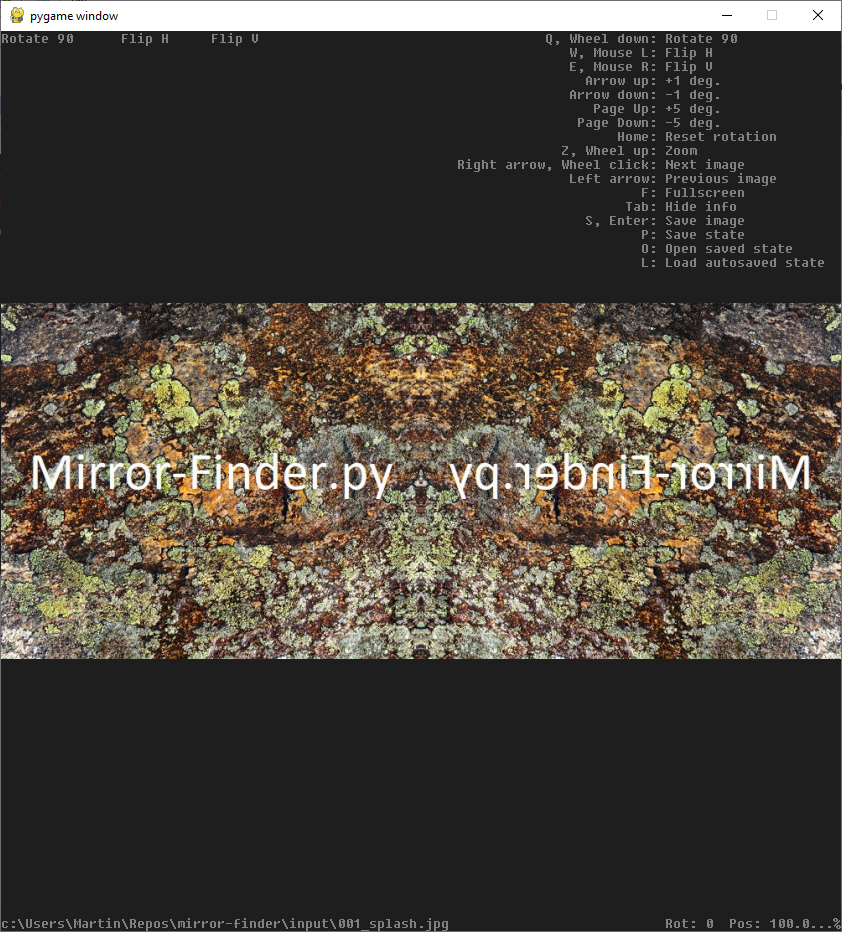

Mirror Finder lets you open an image (jpg, png, tif), apply rotation and flip and use your mouse to explore different mirror positions.
The result can then be saved as a new image.

OpenCV, PyGame and PIL is used for backend.

